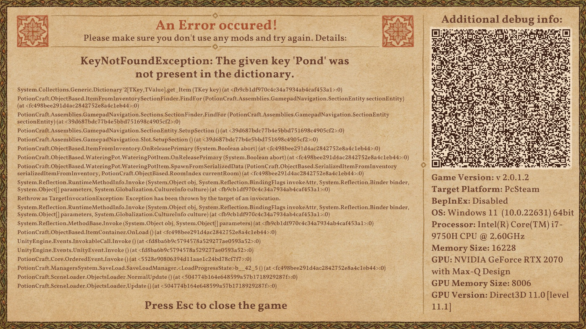
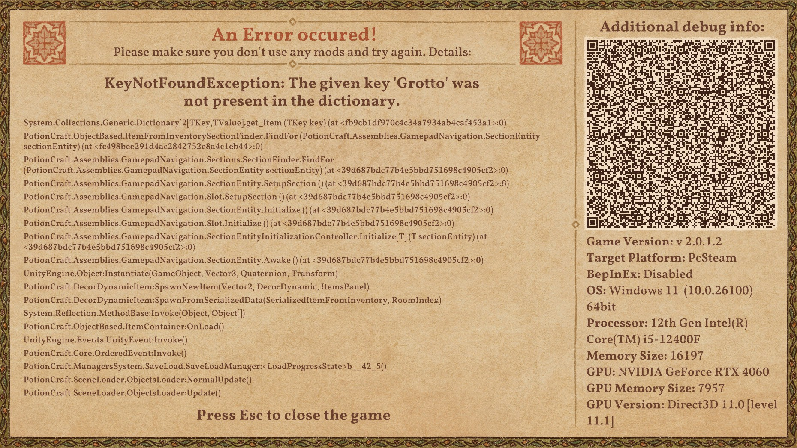
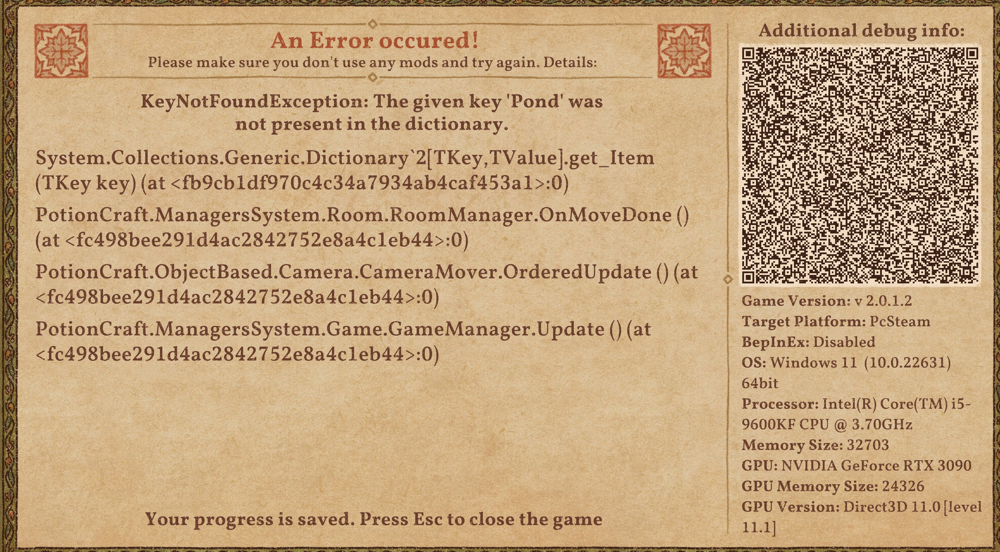
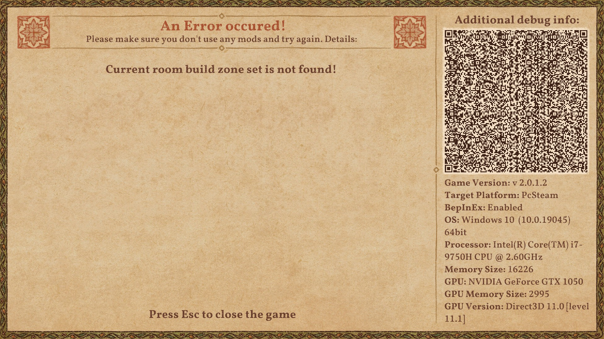
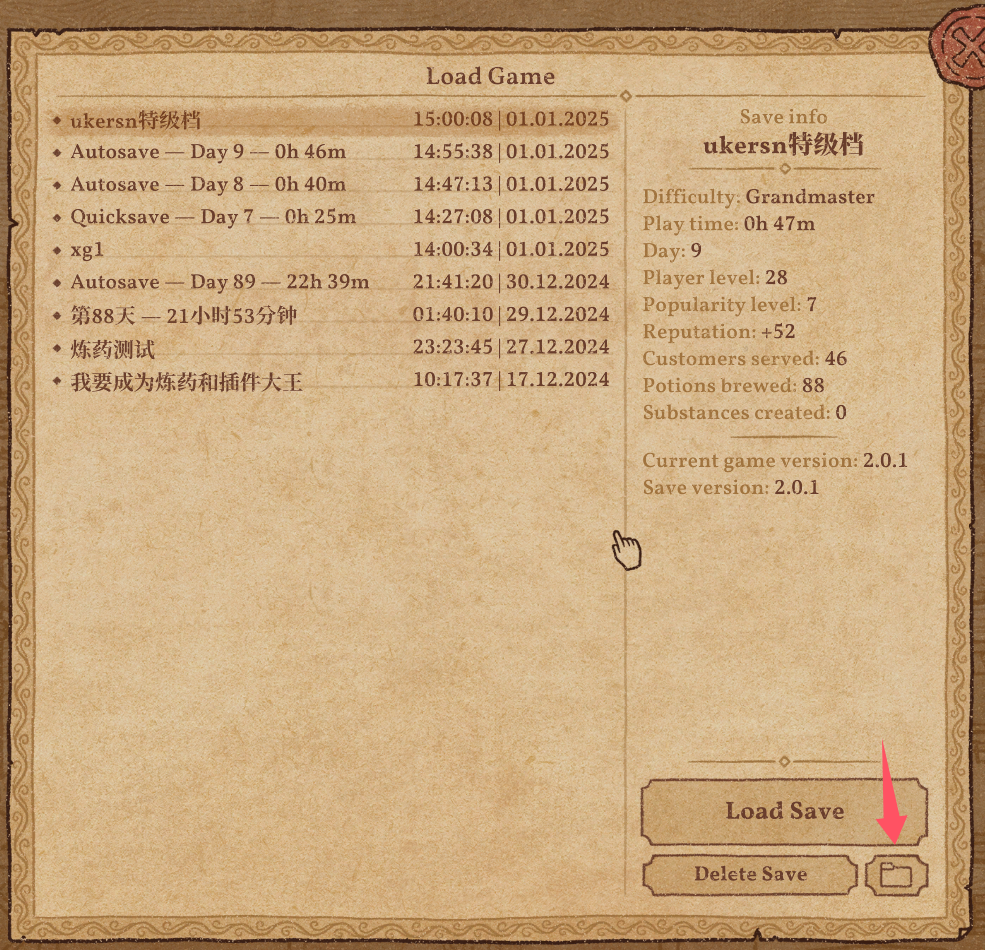

# Potion Craft Save File Error Fixer/Editor

## Introduction

This is a software for manipulating Potion Craft game save files. It has the following features:

1. It attempts to fix save files that produce the following errors:
   
   
   
   

   It makes the following attempts on the game save file:
   
   a. Reset the player's current room view back to the laboratory
   
   b. Reset the coordinates of items located in rooms not unlocked by the player or outside all rooms back to the bedroom
   
   c. Check if the item's BuildZone has been incorrectly saved and correct it

2. Decode game saves, allowing you to manually view and modify data in the game save.

3. Encode game saves, allowing you to encode modified decoded game saves back into a format that the game can load.

## Principle

Potion Craft's save files are fundamentally in JSON format, which is then XOR encrypted and Base64 encoded. 

Each save file includes two separate Base64 encoded contents: the first part saves basic information of the game save, and the second part saves detailed game information.

I wrote a Python script to decrypt game saves, manipulate data in the game saves, and then save them back.

## Usage Instructions

1. Windows users, please download the software packaged in Release to get Editor.exe

2. Find your save file, typically located in: C:\Users\[Username]\AppData\LocalLow\niceplay games\Potion Craft\SavesSteam

   Or by opening the game save folder this way:
   In the game, you can find a button to open the save file folder on the screen where you load saved games.
   
   You will see files with .pcsave extension, such as ErrorAutoSave — 2024.12.27 02.53.31.647 UTC - Day 2 - 0h 1m.pcsave. These are your save files, with the most recently modified file usually being your latest save.
   
3. To repair a save file:

   Drag the save file onto the Editor.exe file in the file explorer. Editor.exe should then get the file path and start attempting to repair the save.
   
   After the save repair is complete, you can close it and open the game to re-enter the repaired save.
   
   Each time a save repair is attempted, a file with the same name as the game save and ending with backup+date and time will be generated in the software's running directory as a backup of the pre-repair save file. You can delete these backups yourself if you confirm that your save has been successfully repaired.
   

If you can't drag the save file onto the Editor.exe file, you can open the system command line (Win+R to open Run, type cmd), then use:

`cd /D Editor's software directory`  

to enter the software's running directory, then use the command: `Editor "game save file path"`

to call the software's save repair function.

For example:
If I downloaded Editor.exe to F:\downloads\

I would enter the following command in the system command line:

`cd /D F:\downloads\`

Then enter (or enter "Editor " and try to drag the game save file to the system command line window):

`Editor "C:\Users\[Username]\AppData\LocalLow\niceplay games\Potion Craft\SavesSteam\ErrorAutoSave — 2024.12.27 02.53.31.647 UTC - Day 2 - 0h 1m.pcsave"`

This way, you can try to repair your save.

At this point, you can try launching the game to see if your save has been successfully repaired. If successful, continue playing the game.

**If after the repair prompt ends, loading the save file and entering the game still results in the same problem, it's possible that Steam's cloud save has overwritten the repaired save file. In this case, try temporarily disabling Steam cloud saves, then repair the save file again, and then enter the game.**

## Additional Features (If you want to do more than just repair game saves)

Use command line for operations.
1. Command: `Editor "game save file path" --decode`   Used to decode the game save and save it as game save name+_decoded.json file in the current running directory
2. Command: `Editor "decoded game save json file path" --encode`   Used to encode the decoded game save and save it as decoded game save json file name+_encoded.pcsave file in the current running directory
3. Directly open Editor.exe or enter Editor in the command line to enter field repair mode, where you can modify the value of a certain data in the save by entering "field1.field2 modified value" (cannot handle lists).

# My Other Projects
[Recipe Book Button Fix][0]: Used to fix a bug where, after playing the game for a long time, the clickable area of the recipe book button becomes larger, overlapping other buttons.

[Auto Garden][1] : Tired of the daily routine of watering plants and harvesting vegetables? Auto Garden is here to help. It can perform all the harvesting and watering actions in your garden for you.

[Ukersn's Tweak Wizard][2] : Allows unrestricted planting of plants and crystals, and features to improve game FPS.

-----

# Potion Craft 游戏存档错误修复器/编辑器

## 简介

这是一个对Potion Craft游戏存档进行操作的软件，它拥有以下功能：

1. 它用于尝试修复产生以下错误的存档：
   
   
   
   
   
   它会对游戏存档文件做以下尝试：
   
   a. 将玩家目前的房间视角重置回实验室
   
   b. 将位于玩家未解锁房间或所有房间外的道具重置坐标回到卧室
   
   c. 检查物品所在BuildZone是否被错误的保存并进行修正

2. 解码游戏存档，这将允许你手动对游戏存档中的数据进行查看和修改。
3. 编码游戏存档，这将允许你将修改后的解码的游戏存档编码回游戏可以加载的存档。

## 原理

Potion Craft的存档底层是JSON格式，其被套了一层XOR加密之后再使用Base64编码。 
并且一个存档包括两段独立的Base64编码的内容，第一段用于保存游戏存档的基本信息，第二段用于保存游戏的详细信息。

我编写了一个Python脚本用于解密游戏存档，并操作游戏存档中的数据，然后保存回去。

## 使用说明

1. Windows用户请下载Release打包好的软件，得到Editor.exe
2. 找到你的存档文件，通常目录是在：C:\Users\[用户名]\AppData\LocalLow\niceplay games\Potion Craft\SavesSteam 中。

   或者你可以通过这个方法打开存档文件夹：
   在游戏中，你可以在载入游戏的界面找到打开从存档文件夹的按钮。
   
   你会看到诸如ErrorAutoSave — 2024.12.27 02.53.31.647 UTC - Day 2 - 0h 1m.pcsave 等以pcsave为文件后缀的文件，他们就是你的存档文件，文件修改日期最新的一般就是你最近一次保存的文件。
   
3. 对存档文件进行修复：
   在文件浏览器中将存档文件拖动到Editor.exe文件上，此时Editor.exe应该获得文件路径并启动尝试修复存档，
   等待存档修复完成后，你就可以关闭它并打开游戏重新进入被修复完成后的存档。
   
   每次尝试修复存档后，都会在软件的运行目录下生成与游戏存档同名的以backup+日期时间为文件后缀结尾的的文件作为修复前存档文件的备份，如果你确认你的存档修复成功后，你可以自己删除这些备份。

如果你无法将将存档文件拖动到Editor.exe文件上，你可以打开系统的命令行(Win+R 打开运行 输入 cmd)，然后使用：
`cd /D Editor的软件目录`  
进入到软件运行目录下，然后使用命令：`Editor "游戏存档文件路径"`
来调用软件的存档修复功能。

例如：
我下载的Editor.exe在F:\downloads\目录下。

我会在系统的命令行输入以下指令：

`cd /D F:\downloads\`

然后再输入(或者输入"Editor " 然后尝试将游戏存档文件拖动到系统的命令行窗口)：

`Editor "C:\Users\[用户名]\AppData\LocalLow\niceplay games\Potion Craft\SavesSteam\ErrorAutoSave — 2024.12.27 02.53.31.647 UTC - Day 2 - 0h 1m.pcsave"`

这样来尝试修复我的存档。

到这一步，你就可以尝试启动游戏看看你的存档被修复成功了没，如果成功了，继续玩游戏去吧。

**如果提示修复结束后，加载存档进入游戏还是同样的问题，则有可能是Steam的云存档覆盖了修复后的存档，这种情况下，尝试暂时关闭Steam云存档，然后再次修复，然后进入游戏。**

## 其他额外功能(如果你不止于修复游戏存档的话)

使用命令行进行操作。

1. 指令：`Editor "游戏存档文件路径" --decode`   用于解码游戏存档，并保存在当前运行目录下的游戏存档名+_decoded.json文件

2. 指令：`Editor "已解码的游戏存档json文件路径" --encode`   用于编码已解码的游戏存档，并保存在当前运行目录下的 已解码的游戏存档json文件名+_encoded.pcsave文件

3. 直接打开Editor.exe或在命令行输入Editor，则进入到字段的修复模式，你可以通过输入 "字段1.字段2 修后的数值" 这样的方式来修改存档中某个数据的值(不能处理列表)。

# 我的其他项目
[配方书按钮修复][0] :用于修复游戏游玩久后配方书按钮可点击区域变大，从而覆盖其他按钮的bug

[自动花园][1] : 厌倦每天日常浇花和收菜的生活了么？自动花园来了，它可以帮您完成花园中所有的收获和浇水的动作。

[Ukersn的游戏调整优化][2] : 允许植物和水晶无限制的种植，还有提升游戏FPS帧数的功能。

[0]: https://github.com/ukersn/PotionCraftOpenRecipeButtonFix
[1]: https://github.com/ukersn/PotionCraftAutoGarden
[2]: https://github.com/ukersn/Potion-Craft-Ukersn-s-TweakWizard